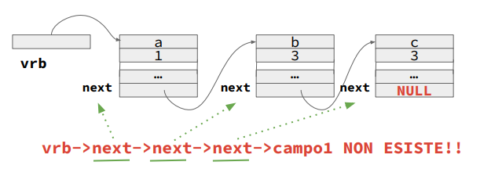

# Appunti Programmazione II

## Malloc

Permette di allocare dinamicamente (durante l’esecuzione del programma) una quantità di memoria specificata

```c
cast-type *ptr;

ptr = (cast-type *) malloc(byte-size);
```

- `cast-type`: Tipologia di variabilem (`int`, `float`, `char`, etc.)
- `byte-size`: Dimensione di memoria da allocare [in `byte`]

### Esempio

```c
int *x;
x = (int *) malloc (sizeof (int));
```

- `malloc` restituisce `*void` (fare poi il cast)
- `sizeof` resituisce la dimensione in `byte`

### Allocazione di un Array

```c
int astatico[N];

int *adinamico=(int *)malloc(sizeof(int)*N);
```

`astatico` e `adinamico` possono essere usati allo stesso identico modo.

## Free

Permette di liberare dinamicamente [`deallocare`] (durante l’esecuzione del programma) della memoria precedentemente allocata in maniera dinamica.

Dopo `free` tale memoria non sarà più accessibile

```c
cast-type *ptr;

ptr = (cast-type *) malloc(byte-size);

free(ptr);
```

### Esempio

```c
int *x;
x = (int *) malloc (sizeof (int));

free(x);
```

### Deallocazione di un Array

Per evitare `dangling pointers` (puntatori pendenti), è buona pratica assegnare `NULL` al puntatore dopo la free, come correttamente mostrato nel codice:

```c
free(array);

array = NULL;
```

---

## Memoria Statica / Dinamica

| STATICA - `tempo`                                | DINAMICA - `spazio`                   |
| ------------------------------------------------ | ------------------------------------- |
| ➔ accesso più rapido                             | ➔ accesso meno rapido                 |
| ➔ occupo memoria anche per variabili che non uso | ➔ occupo solo la memoria che mi serve |

---

## Tipi composti

- **`array mono e multi-dimensionali`**: tutti gli elementi sono omogenei (dello stesso tipo)
- **`strutture`**: gli elementi possono essere disomogenei (di tipi diversi)
- **`unioni`**: la variabile ha più vesti, può essere alternativamente di un tipo o di un altro

---

## Strutture

```c
struct libro {
  char titolo[MAXT];
  int pagine;
  char autore[MAXN];
  float prezzo;
};

struct libro l1; // creo una variabile `l1` di tipologia `libro`
```

### Strutture in memoria - `padding`


I sistemi operativi non allocano la memoria a byte ma a gruppi di `4, 8, 16 ... byte`

```c
struct s {
  char x;
  char y;
  int z;
};

sizeof(struct s) = 8

sizeof(char)*2 + sizeof(int) = 6
```

###  `typedef`

Spesso struct viene usato insieme a `typedef`

```c
typedef struct {
  char titolo[MAXT];
  int pagine;
  char autore[MAXN];
  float prezzo;
} libro; // nuovo tipo `libro`

libro l1; // variabile `l1` di tipo `libro`
```

### Deallocazione di una struct

```c
libro * l;

l = (libro *) malloc(sizeof(libro);

free(l);
l = NULL;
```

! Ricordarsi `l = NULL`


### Differenza tra `.` e `->`

* Si usa `.` quando si ha a che fare con **VARIABILI**
* Si usa `->` quando si ha a che fare con **PUNTATORI**

```c
typedef struct {
  int n;
} str;


str s1;
s1.n = 1;

// ----------

str *s2 = (str*) malloc(sizeof(str));;
s2->n = 1;
```

### Liste Concatenate

Creazione di una lista da 3 elementi

1) Dichiarazione
    ```c
    typedef struct nodo {
      int a;
      float b;
      char c;

      struct nodo* next;
    } nodo;

    typedef nodo* lista;
    ```

2) Assegnazione

    ```c
    lista head = malloc(sizeof(nodo));

    head->a = 1;
    head->b = 1.1;
    head->c = 'A';
    head->next = NULL;

    // Creazione del secondo nodo
    lista secondo = malloc(sizeof(nodo));

    secondo->a = 2;
    secondo->b = 2.2;
    secondo->c = 'B';
    secondo->next = NULL;
    head->next = secondo; // Collegamento del primo al secondo nodo

    // Creazione del terzo nodo
    lista terzo = malloc(sizeof(nodo));

    terzo->a = 3;
    terzo->b = 3.3;
    terzo->c = 'C';
    terzo->next = NULL;
    secondo->next = terzo; // Collegamento del secondo al terzo nodo
    ```

3) Visualizzazione
    ```c
    // Stampa della lista
    lista temp = head;
    while (temp != NULL) {
      printf("Nodo: a=%d, b=%.1f, c=%c\n", temp->a, temp->b, temp->c);
      temp = temp->next;
    }
    ```

4) Deallocazione
    ```c
    while (head != NULL) {
      lista temp = head;
      head = head->next;
      free(temp);
    }
    ```



