# Appunti Programmazione II

## Malloc

Permette di allocare dinamicamente (durante l’esecuzione del programma) una quantità di memoria specificata

```c
cast-type *ptr;

ptr = (cast-type *) malloc(byte-size);
```

- `cast-type`: Tipologia di variabilem (`int`, `float`, `char`, etc.)
- `byte-size`: Dimensione di memoria da allocare [in `byte`]

### Esempio

```c
int *x;
x = (int *) malloc (sizeof (int));
```

- `malloc` restituisce `*void` (fare poi il cast)
- `sizeof` resituisce la dimensione in `byte`

### Allocazione di un Array

```c
int astatico[N];

int *adinamico=(int *)malloc(sizeof(int)*N);
```

`astatico` e `adinamico` possono essere usati allo stesso identico modo.

## Free

Permette di liberare dinamicamente [`deallocare`] (durante l’esecuzione del programma) della memoria precedentemente allocata in maniera dinamica.

Dopo `free` tale memoria non sarà più accessibile

```c
cast-type *ptr;

ptr = (cast-type *) malloc(byte-size);

free(ptr);
```

### Esempio

```c
int *x;
x = (int *) malloc (sizeof (int));

free(x);
```

### Deallocazione di un Array

Per evitare `dangling pointers` (puntatori pendenti), è buona pratica assegnare `NULL` al puntatore dopo la free, come correttamente mostrato nel codice:

```c
free(array);

array = NULL;
```

---

## Memoria Statica / Dinamica

| STATICA - `tempo`                                | DINAMICA - `spazio`                   |
| ------------------------------------------------ | ------------------------------------- |
| ➔ accesso più rapido                             | ➔ accesso meno rapido                 |
| ➔ occupo memoria anche per variabili che non uso | ➔ occupo solo la memoria che mi serve |

---

## Tipi composti

- **`array mono e multi-dimensionali`**: tutti gli elementi sono omogenei (dello stesso tipo)
- **`strutture`**: gli elementi possono essere disomogenei (di tipi diversi)
- **`unioni`**: la variabile ha più vesti, può essere alternativamente di un tipo o di un altro

---

## Strutture

```c
struct libro {
  char titolo[MAXT];
  int pagine;
  char autore[MAXN];
  float prezzo;
};

struct libro l1; // creo una variabile `l1` di tipologia `libro`
```

### Strutture in memoria - `padding`

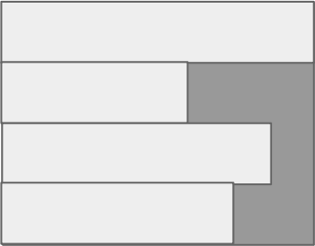

I sistemi operativi non allocano la memoria a byte ma a gruppi di `4, 8, 16 ... byte`

```c
struct s {
  char x;
  char y;
  int z;
};

sizeof(struct s) = 8

sizeof(char)*2 + sizeof(int) = 6
```

### `typedef`

Spesso struct viene usato insieme a `typedef`

```c
typedef struct {
  char titolo[MAXT];
  int pagine;
  char autore[MAXN];
  float prezzo;
} libro; // nuovo tipo `libro`

libro l1; // variabile `l1` di tipo `libro`
```

### Deallocazione di una struct

```c
libro * l;

l = (libro *) malloc(sizeof(libro);

free(l);
l = NULL;
```

! Ricordarsi `l = NULL`

### Differenza tra `.` e `->`

- Si usa `.` quando si ha a che fare con **VARIABILI**
- Si usa `->` quando si ha a che fare con **PUNTATORI**

```c
typedef struct {
  int n;
} str;


str s1;
s1.n = 1;

// ----------

str *s2 = (str*) malloc(sizeof(str));;
s2->n = 1;
```

### Liste Concatenate (linkate)

Creazione di una lista da 3 elementi

1. Dichiarazione

   ```c
   typedef struct nodo {
     int a;
     float b;
     char c;

     struct nodo* next;
   } nodo;

   typedef nodo* lista;
   ```

2. Assegnazione

   ```c
   lista head = malloc(sizeof(nodo));

   head->a = 1;
   head->b = 1.1;
   head->c = 'A';
   head->next = NULL;

   // Creazione del secondo nodo
   lista secondo = malloc(sizeof(nodo));

   secondo->a = 2;
   secondo->b = 2.2;
   secondo->c = 'B';
   secondo->next = NULL;
   head->next = secondo; // Collegamento del primo al secondo nodo

   // Creazione del terzo nodo
   lista terzo = malloc(sizeof(nodo));

   terzo->a = 3;
   terzo->b = 3.3;
   terzo->c = 'C';
   terzo->next = NULL;
   secondo->next = terzo; // Collegamento del secondo al terzo nodo
   ```

3. Visualizzazione

   ```c
   // Stampa della lista
   lista temp = head;
   while (temp != NULL) {
     printf("Nodo: a=%d, b=%.1f, c=%c\n", temp->a, temp->b, temp->c);
     temp = temp->next;
   }
   ```

4. Deallocazione
   ```c
   while (head != NULL) {
     lista temp = head;
     head = head->next;
     free(temp);
   }
   ```

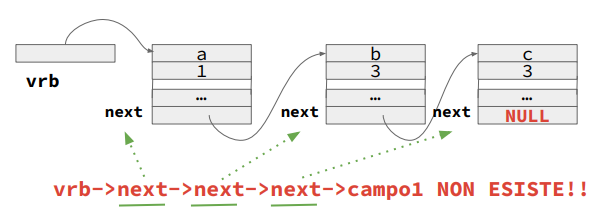

5. Eliminare un elemento della lista

   Per eliminare un elemento della lista, bisogna cambiare il valore della variabile `next`, facendo puntare il puntatore ad un altro elemento della lista.

   Ricordarsi poi di fare la `free()` per deallocare l'elemento della lista ormai superfluo

   ```c
   void cancella_testa(lista *L) {
     lista tmp = (*L);
     *L = (*L)->next;
     free(tmp);
   }
   ```

   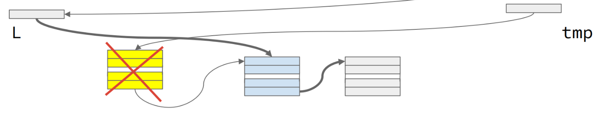

6. Aggiungere un elemento in testa

   ```c
   void aggiungi_in_testa(lista *L, lista nuovo) {
     nuovo->next = *L;
     *L = nuovo;
   }
   ```

   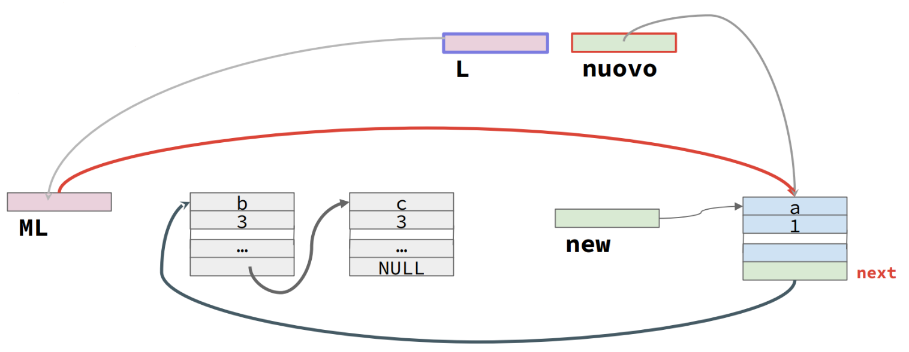

#### Tipologie di liste

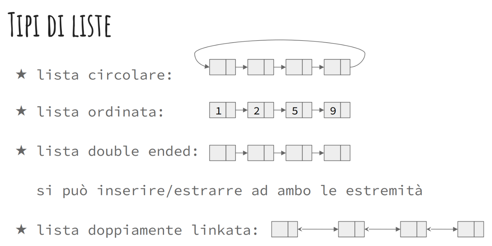

### Funzioni `ricorsive` su liste

Esempio:

```c
int somma_nodi(lista l) {
  if (l == NULL) return 0;
  return (l->dato + somma_nodi(l->next));
}
```

Controparte iterativa:

```c
int somma_iter(lista l) {
  int ris = 0;

  while (l) {
    ris += l->dato;
    l = l->next;
  }

  return ris;
}
```

#### RICORSIONE in `testa`/`coda`

**`TESTA`**

```c
tipo-ritorno FUNZIONE(params …) {
  if (test-caso-base1) ... return1
  ...

  else {
    [vrb-temp =] FUNZIONE(...); // prima richiamo ricorsivo
    elabora nodo corrente // poi elaboro il nodo corrente
    return ...
  }
}

// ESEMPIO
void stampa(lista l) {
  if (l != NULL) {
    printf(" %d,", l->dato); // elaboro nodo
    stampa(l->next); // ricorsione sul next
  }
  else printf(" /\n");
}
```

**`CODA`**

```c
tipo-ritorno FUNZIONE(params …) {
  if (test-caso-base1) ... return1
  ...

  else {
    elabora nodo corrente // prima elaboro il nodo corrente
    [vrb-temp =] FUNZIONE(...); // poi richiamo ricorsivo
    return ...
  }
}

// ESEMPIO
void stampa_inversa(lista l) {
  if (l != NULL) {
    stampa_inversa(l->next); // ricorsione sul next
    printf(" %d,", l->dato); // elaboro nodo
  }
  else printf(" /\n");
}
```

#### Ricorsione in `testa`/`coda` con valore di ritorno

**Richiamo in `testa`**

```c
int conta(lista L, int S) {
  if (!L) return 0;
  else if (L->peso >= S) return 0;
  else {
    int temp = conta(L->next,S);
    return (1 + temp);
  }
}
```

**Richiamo in `coda`**

```c
int conta2(lista l, int S) {
  if (!l) return 0; // (1) caso base lista vuota
  else if (l->peso >= S) return 0; // (2) caso base non ho altro da contare

  return (1 + conta2(l->next, S));
}
```

##### Rimozione in `coda` con ricorsione in `testa`

**Lista passata per riferimento**

```c
void elimina_lista(lista *l) {
  if (l) {
    if (*l) { // se la lista non è vuota
      elimina_lista(&((*l)->next)); // mi sposto avanti
      free(*l); // libero il nodo (attuale ultimo)
      *l = NULL;
    }
  }
}
```

**Lista passata per valore**

```c
lista elimina_lista(lista l) {
  if (l) {
    l->next=elimina_lista(l->next);
    free(l);
    return NULL;
  }

  return NULL;
}
```

##### Inserimento di un elemento nella lista [ORDINATA]

**Lista passata per valore**

```c
lista inserimento_ordinato(lista l, lista nodo) {
  if (l) {
    if (nodo->dato <= l->dato) {
      // nodo inserito nella prima posizione
      nodo->next = l;
      return nodo;
    } else if (nodo->dato < l->next->dato) {
      // nodo maggiore di `l` e minore di `l->next`
      nodo->next = l->next;
      l->next = nodo;
      return l;
    } else {
      // nodo maggiore sia di `l` sia di `l-next`
      // non sono nella posizione giusta, ricorsione
      l->next = inserimento_ordinato(l->next, nodo);
      return l;
    }
  }

  return nodo;
}
```

**Lista passata per riferimento**

```c
void inserimento_ordinato(lista *l, lista nodo) {
  if (l) {
    if (*l) {
      if (nodo->dato <= (*l)->dato) {
        // nodo va inserito in prima posizione
        nodo->next = *l;
        *l = nodo;
      } else if (!((*l)->next)) {
        // `l` ultimo e nodo maggiore di `l`, diventa lui l'ultimo
        (*l)->next = nodo;
        nodo->next = NULL;
      } else if (nodo->dato < (*l)->next->dato) {
        // nodo maggiore di `l` e minore di `l->next`
        nodo->next = (*l)->next;
        (*l)->next = nodo;
      } else {
        // nodo maggiore sia di `l` sia di `l-next`
        inserimento_ordinato(&(*l)->next, nodo);
      }
    }
  }

  // `l` era NULL e nodo diventa il primo e solo elemento
  *l = nodo;
}
```

## ADT `Abstract Data Type`

- definisco un tipo di dato indipendentemente dalla sua implementazione
- definisco la struttura dei dati (e i loro valori possibili: il dominio) e le operazioni su di essi

### Esempio: Radio

```c
#define ON 1
#define OFF 0

typedef struct {
  int accensione = OFF;
  int canale;
} radio;

/**
 * @brief data una radio, setta l’accensione a acceso
 */
void accendi(radio *r) {
  r->accensione = ON;
}

/**
 * @brief data una radio, setta l’accensione a spento
 */
void spegni(radio *r) {
  r->accensione = OFF;
}

/**
 * @brief data una radio, setta la sintonizzazione sul canale specificato
 */
void sintonizza(radio *r, int c) {
  r->canale = c;
}
```

### ADT fondamentali

- `pile` (`stack`)
- `code` (`queue`)
- `insiemi` (`set`)

#### Pila (Stack)

⟹ **LIFO** - Last In First Out

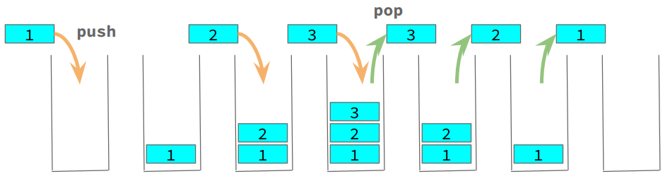

##### Operazioni dello Stack

- `Push`: aggiungi un elemento in cima allo stack

  ```c
  void push(<tipo-dato> el, stack *s)
  ```

- `Pop`: rimuovi un elemento dalla cima dello stack

  ```c
  <tipo-dato> pop(stack *s)
  ```

- `Empty`: verifica se lo stack è vuoto

  ```c
  int empty(stack s)
  ```

- `Full`: verifica se lo stack è pieno [se limitato]

  ```c
  int full(stack s)
  ```

- `Peek`: ottieni il valore in cima allo stack senza rimuoverlo

  ```c
  <tipo-dato> peek(stack s)
  ```

#### Coda (Queue)

⟹ **FIFO** - First In First Out

Una coda è un particolare tipo di sequenza in cui gli elementi sono inseriti ad un capo e sono rimossi dal capo opposto

##### Operazioni (principali) della Queue

- `Enqueue`: inserisce un elemento in fondo (tail) alla coda

  ```c
  void enqueue(tipo-dato el, coda *Q)
  ```

  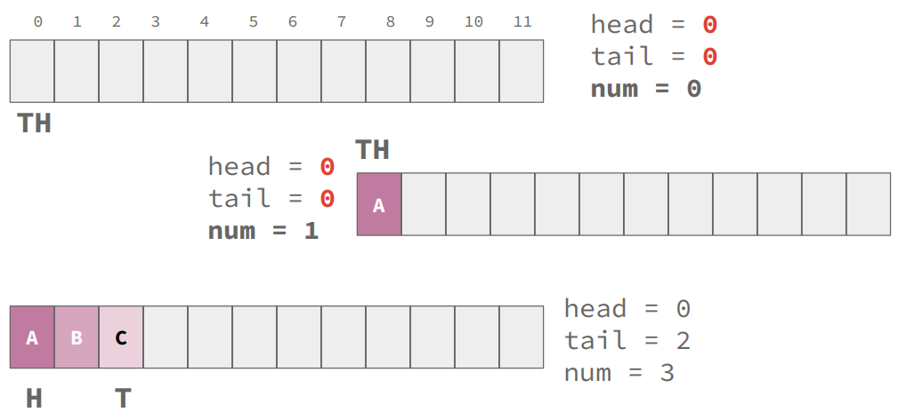

- `Dequeue`: rimuove un elemento dalla testa (head) della coda

  ```c
  tipo-dato dequeue(coda *Q)
  ```

  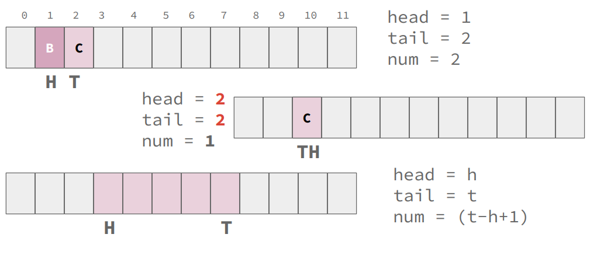

- `Full` / `Empty` / `Peek`

  ```c
  int full(coda Q)
  int empty(coda Q)
  tipo-dato peek(coda Q)
  ```

- `Init`: inizializza una coda

  ```c
  void init(coda *Q)
  ```


**Coda circolare**

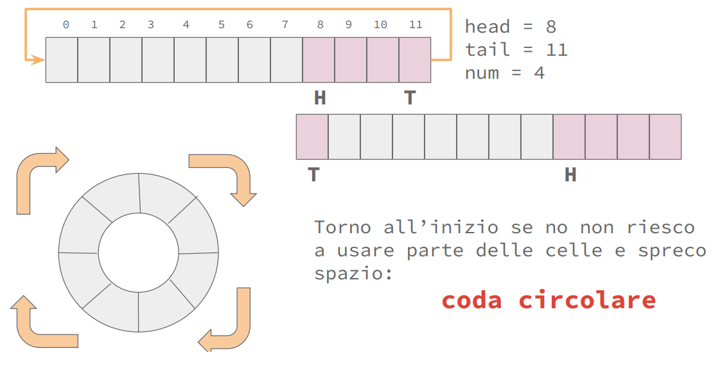

`N % k`: `N` modulo `k`, *resto della divisione intera* di `N` per `k`.

- si usa per calcolare il successore in un array circolare

Esempio: Coda da 5 elementi

```c
int successore(int i, int N) {
  return ((i + 1) % N);
}

successore(0, 5) → 1
successore(1, 5) → 2
...
successore(4, 5) → 0
```

#### Insieme (Set, Bunch)

⟹ `∄` NON ESISTE primo e/o ultimo

- Quando lo stesso elemento compare soltanto una volta si parla di ***INSIEME***
- Quando lo stesso elemento compare più volte si parla di ***MULTI-INSIEME***

##### Operazioni (principali) di un Set

```c
int elem(tipo-dato el, set S) // test
int vuoto(set S) // test

void init(set *S) // inizializza a vuoto
int cardinality(set S) // numero di elementi di S

set *costruisci(tipo-dato x1, ..., xn) // crea un set contenente i valori x1, x2, ..., xn
set *crea_max(int N) // crea un set di capacità massima N

void aggiungi(set *S, tipo-dato el) // aggiunge `el` al set

void togli(set *S, tipo-dato el) // toglie la prima occorrenza di `el` dal set
void togli_tutti(set *S, tipo-dato el) // toglie tutte le occorrenze di `el` dal set
```


## Funzioni Variadiche


```c
#include <stdarg.h>
<valore-ritorno> funzione(argf1 ... argfN, ...)

/*
P_IN: num ≥ 0, i restanti argomenti, senza nome, sono nel numero indicato da num
P_OUT: nuovo == set di cardinalità pari a num, i cui valori sono tutti e soli i valori degli argomenti senza nome; nuovo==NULL se num==0
*/
void *func(int num, ...) {
 // `...` indicano che la funzione è variadica
 //   > devo fare riferimento alla lista degli argomenti
 //   > devo allocare un set e inserire iterativamente in esso i valori

 // ATTENZIONE: se num è 0 allora restituisco NULL

  va_list ptr; // puntatore alla lista degli argomenti
  va_start(ptr, num); // il puntatore fa ora riferimento al primo elem dei param opzionali
  va_arg(ptr, int); // fornita da stdarg, restituisce il dato corrente e aggiorna il puntatore. Richiede che si passi il tipo di dato atteso come valore
}
```

---

## Alberi

Differenza tra uno `Stack`/`Queue`/`Set` e un `Albero`/`Grafo`

| `Stack`/`Queue`/`Set`                                | `Albero`/`Grafo`                   |
| ------------------------------------------------ | ------------------------------------- |
| ➔ ogni nodo ha (al più) un solo successore e (al più) un solo predecessore diretti                             | ➔ ogni nodo può avere molti successori/predecessori diretti                 |

<br>

Differenza tra un `Albero` e un `Grafo`

| `Albero`                                | `Grafo`                   |
| ------------------------------------------------ | ------------------------------------- |
| ➔ ogni nodo può avere molti successori ma ha al più un predecessore diretto                             | ➔ ogni nodo può avere molti successori/predecessori diretti                 |

### Alberi Binari

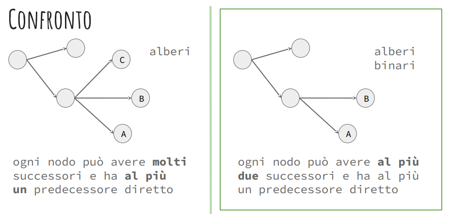

#### Terminologia

- `Radice`

  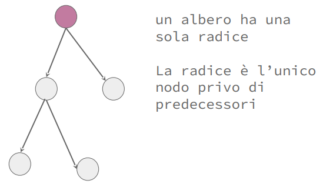

- `Nodo Interno`

  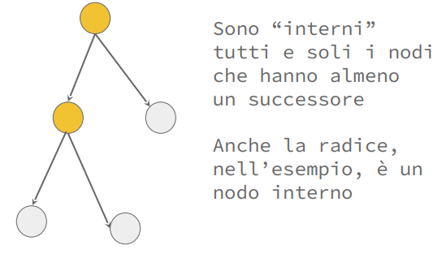

- `Foglia`

  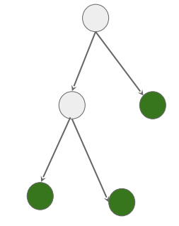

  - `Frontiera`

    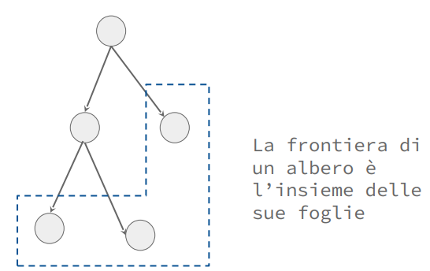

##### **`Archi`**

Un `Arco` è un collegamento orientato fra due nodi

- L’orientamento permette di capire il ruolo dei nodi: chi è **padre** e chi **figlio**

##### **Gerarchia** dei nodi

- `Padre`

  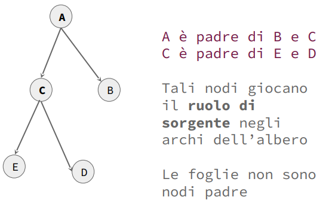

- `Figlio`

  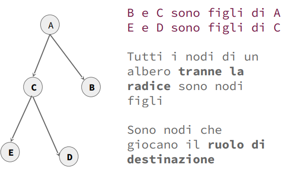

- `Antenato`

  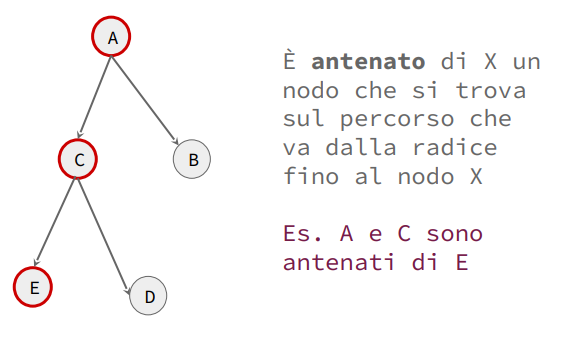

- `Discendente`

  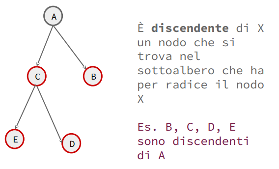

##### **`Percorsi`**

Un `Percorso` è una sequenza di nodi collegati da archi *N1*, *N2*, ..., *Nk* 

- `Percorso Assoluto`

  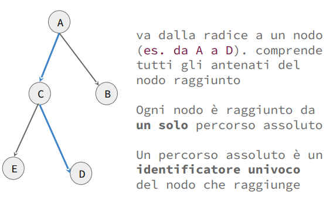

- `Percorso Relativo`

  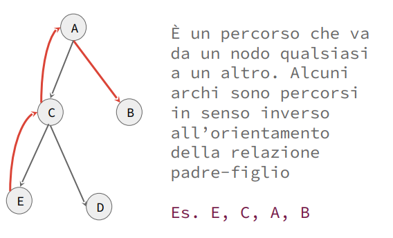

##### **`Sottoalberi`**

Un `Sottoalbero` è un albero che fa parte di un albero più grande

Ogni sottoalbero ha una radice

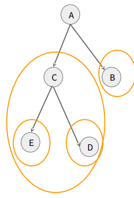


##### **Distanze**

- `Distanza`

  La distanza tra due nodi N1 e N2 di un albero è il numero di "salti" che occorre fare per raggiungere l’uno dall’altro

  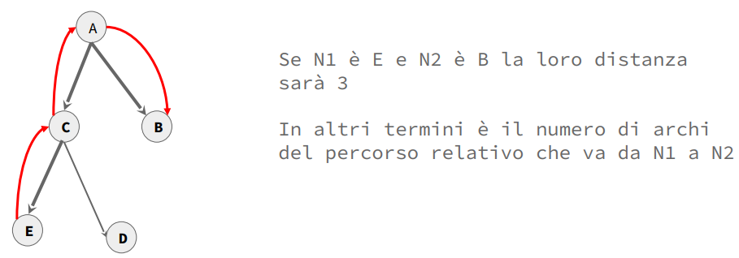

- `Profondità`

  La distanza di un nodo N dalla radice è un caso particolarmente significativo di distanza: cattura la **profondità** di un nodo

  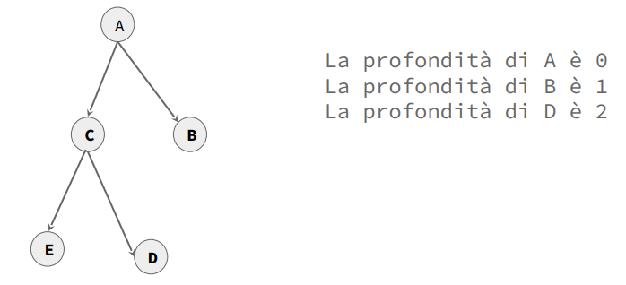

  - `Profondità dell'albero`

    La profondità di un albero è la profondità massima dei suoi nodi.

    1. Se l’albero contiene solo la radice la profondità è *`0`*
    2. Se l’albero è vuoto la profondità è *`-1`*

##### ***Grado***

- Il grado di un nodo è il suo **numero di figli**
- Si dice che un albero di grado `N` è completo quando tutte le sue foglie si trovano a  rofondità `N` e tutti i nodi interni hanno esattamente `N` figli


### Alberi Binari Ordinati

Un albero ordinato (spesso chiamato anche albero di ricerca binario) è una struttura dati in cui i nodi sono disposti in modo tale da mantenere un **ordine specifico** che facilita la **ricerca** e altre operazioni

- Contiene valori interi `int`

- Relazione d'ordine: `>` (MAGGIORE)

  ```
  ∀ n nodo con figli dell’albero
    ∀ n_sn nodo sottoalbero sinistro di n: ∊
      valore(s_n) < valore(n)
    ∀ n_dx nodo sottoalbero destro di n: ∊
      valore(n) < valore(n_dx)
  ```

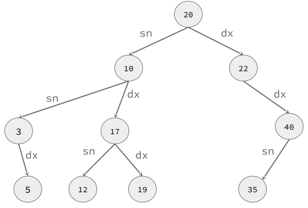

```c
typedef struct nodo* tree;

struct nodo {
  tree left;
  tree right;
  <tipo-dato1> dato1;
  ...
  <tipo-datoN> datoN;
}
```

##### Operazioni (principali) di un Set

```c
void init(tree *T);
tree crea_nodo(tipo-dato el);
void add(tree nuovo, tree *T, ...);
tree remove(tipo-dato el, tree *T);
void stampa(tree T);
int conta_nodi(tree T);
```
